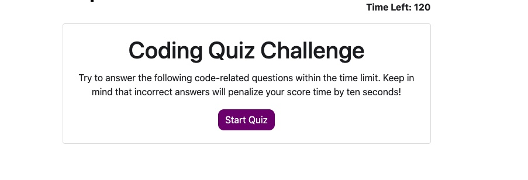

# javascript-fundamentals-quiz

## The Repository
This site is stored in the "javascript-fundamentals-quiz" repository on Alix's github account (username: awebb8). All HTML, CSS, and image files are stored here. This repository is public.  
Link to Repository:  https://github.com/awebb8/javascript-fundamentals-quiz
Link to the project's web page:  https://awebb8.github.io/javascript-fundamentals-quiz/

## Project Goal
Build a timed code quiz with multiple-choice questions. This app will run in the browser and feature dynamically updated HTML and CSS powered by your JavaScript code. It will also feature a clean and polished user interface and be responsive, ensuring that it adapts to multiple screen sizes.

## My Responsive Portfolio

## About the Quiz
Click the start button to begin the quiz.  Answer each question by clicking on the button that you believe is the correct answer.  The page will display "Correct" or "Wrong" based on your answer choice.  If you answer a question incorrectly, 10 seconds will be subtracted from the timer.  The quiz is over when the timer reaches 0 or you are done answering all the questions.  At the end of the quiz, you will be informed of your score, and you will be asked to input and submit your initials.  High scores are displayed so that you can gauge your progress compared to your peers.

